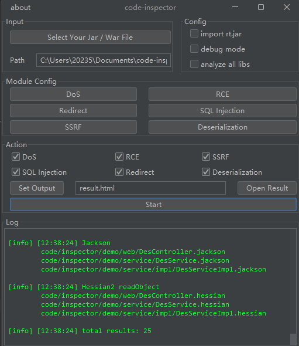
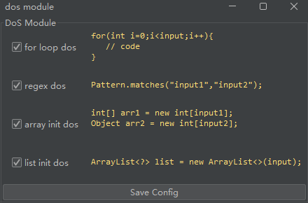
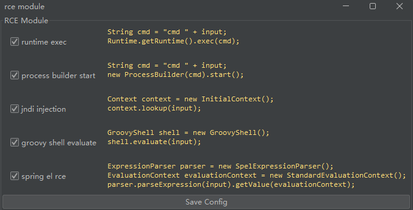
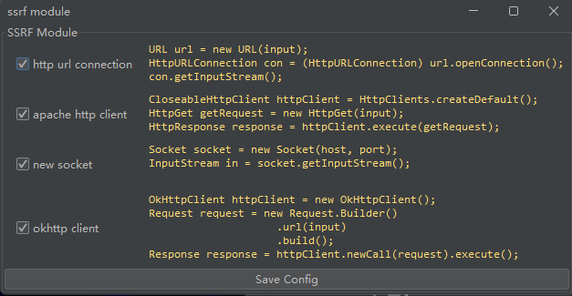
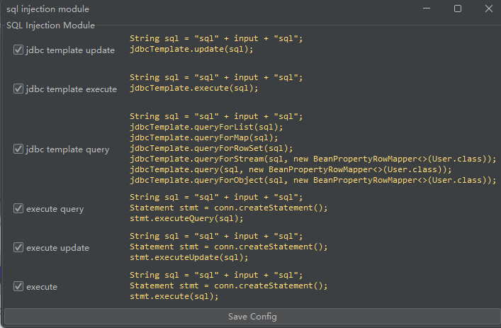
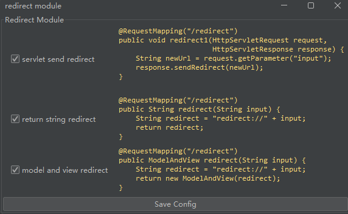
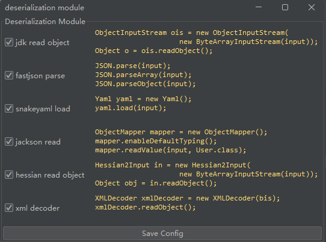

# code-inspector


一个Java自动代码审计工具，尤其针对SpringBoot框架，也可自行改造以适配其他情况

提供一个SpringBoot的Jar包即可进行自动代码审计并生成报告，底层技术基于字节码分析


由于没有真正的执行，例如无法识别过滤等操作，所以会存在误报`false positive`

注意：漏洞检测并不是简单地检测某个方法内是否包含敏感方法，而是从每个`Controller`的每个`Mapping`的每一个用户可控参数开始分析与追踪，构建出方法调用链，分析这个参数在整个链路的过程

## 成果

[漏洞扫描成果](doc/ACHIEVE.md)

## 使用`GUI`启动器

选择好你的`Jar`包后点击`Start`即可，默认开启所有配置

注意：目标`Jar`是`Java 8`编译的情况下兼容性最佳，高版本`Java`可能优化指令导致与原规则不匹配产生漏报

选项：
- import rt.jar 绝大多数情况请勿勾选
- analyze all libs 绝大多数情况请勿勾选
- debug mode 保存一些临时的分析结果到当前目录中



### DoS

配置`DoS`模块：
- `for`循环停止条件可控
- 正则规则和输入同时可控
- 数组初始化大小可控
- `ArrayList`初始化大小可控



### RCE

配置`RCE`模块：
- `Runtime.exec`直接/拼接执行命令
- `ProcessBuilder`直接/拼接执行命令
- `JNDI`注入导致RCE（`lookup`内容可控）
- `GroovyShell.evaluate`直接/拼接执行命令
- `Spring EL`直接/拼接执行命令



### SSRF

配置`SSRF`模块：
- `HttpUrlConnection`请求
- `Apache HttpClient`请求
- `Socket`建立新连接
- `OKHttp`请求



### SQL Injection

配置`SQL Injection`模块：
- `JdbcTemplate.update`存在字符串拼接
- `JdbcTemplate.execute`存在字符串拼接
- `JdbcTemplate.queryAny`存在字符串拼接
- `Statement.executeQuery`存在字符串拼接
- `Statement.executeUpdate`存在字符串拼接
- `Statement.execute`存在字符串拼接



### Open Redirect

配置`Redirect`模块：
- 使用`HttpServletResponse.sendRedirect`重定向
- 使用`SpringMVC`直接返回`String`可控
- 使用`SpringMVC`返回`ModelAndView`可控



### Deserialization

配置`Deserialization`模块：
- `Java`原生反序列化
- `Fastjson`反序列化
- `SnakeYAML`反序列化
- `Jackson`反序列化
- `Hessian2`反序列化
- `XMLDecoder`反序列化



## 使用`API`

可以使用以下的方式方便地进行扫描，注意三个`boolean`参数绝大多数情况应该设置为`false`

```java
public static void testRCE() {
    CodeInspector inspector = new CodeInspectorImpl();
    List<ResultInfo> results = inspector.analyzeRCE(
            "your/path/to/jar/file",
            false, false, false);
    System.out.println(results.size());
}
```

## 常见问题

[常见问题](doc/QUESTIONS.md)

## 如何构建方法调用链

[如何构建方法调用链](doc/CHAINS.md)

## 如何处理分支

[如何处理分支](doc/LABEL.md)

## 通用污点传递规则

[通用污点传递规则](doc/TAINT.md)

## 如何编写新规则

[如何编写新规则](doc/NEW.md)