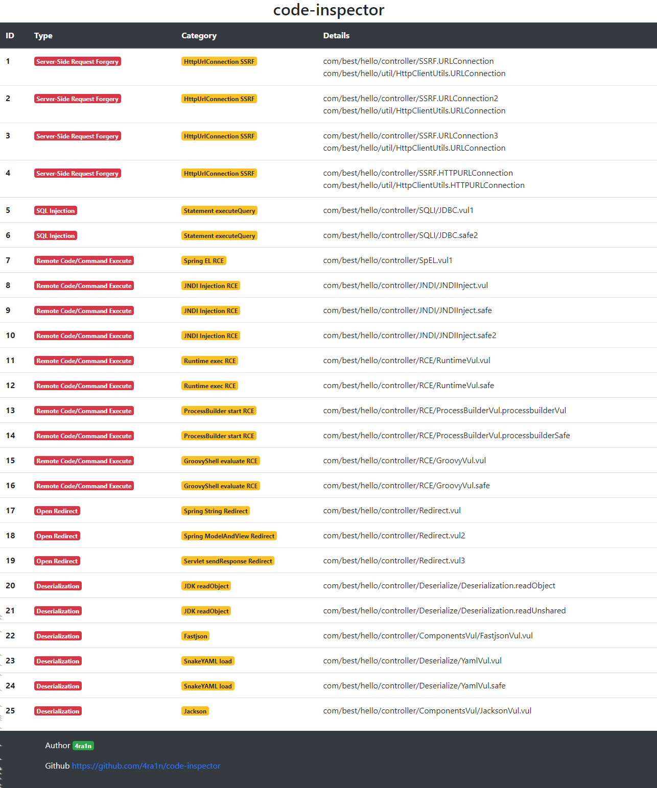

# code-inspector


一个Java自动代码审计工具，尤其针对SpringBoot框架，也可自行改造以适配其他情况

提供一个SpringBoot的Jar包即可进行自动代码审计并生成报告，底层技术基于字节码分析


由于没有真正的执行，例如无法识别过滤等操作，所以会存在误报`false positive`

## 成果

以下靶机存在`JDK 8`下编译打包

靶机`https://github.com/j3ers3/Hello-Java-Sec`的扫描报告：

<details>

<summary>show details</summary>
<br>



</details>

靶机`https://github.com/l4yn3/micro_service_seclab`的扫描报告：

<details>

<summary>show details</summary>
<br>


</details>

靶机`https://github.com/ffffffff0x/JVWA`的扫描报告：

<details>

<summary>show details</summary>
<br>


</details>

靶机`https://github.com/tangxiaofeng7/SecExample`的扫描报告：

<details>

<summary>show details</summary>
<br>


</details>

自带靶机`code-inspector-demo`的扫描报告：

<details>

<summary>show details</summary>
<br>


</details>

## 使用`GUI`启动器

选择好你的`Jar`包后点击`Start`即可，默认开启所有配置

<details>

<summary>show details</summary>
<br>

选项：
- import rt.jar 绝大多数情况请勿勾选
- analyze all libs 绝大多数情况请勿勾选
- debug mode 保存一些临时的分析结果到当前目录中


</details>

### DoS

<details>

<summary>show details</summary>
<br>

配置`DoS`模块：
- `for`循环停止条件可控
- 正则规则和输入同时可控
- 数组初始化大小可控
- `ArrayList`初始化大小可控


</details>

### RCE

<details>

<summary>show details</summary>
<br>

配置`RCE`模块：
- `Runtime.exec`直接/拼接执行命令
- `ProcessBuilder`直接/拼接执行命令
- `JNDI`注入导致RCE（`lookup`内容可控）
- `GroovyShell.evaluate`直接/拼接执行命令
- `Spring EL`直接/拼接执行命令


</details>

### SSRF

<details>

<summary>show details</summary>
<br>

配置`SSRF`模块：
- `HttpUrlConnection`请求
- `Apache HttpClient`请求
- `Socket`建立新连接
- `OKHttp`请求


</details>

### SQL Injection

<details>

<summary>show details</summary>
<br>

配置`SQL Injection`模块：
- `JdbcTemplate.update`存在字符串拼接
- `JdbcTemplate.execute`存在字符串拼接
- `JdbcTemplate.queryAny`存在字符串拼接
- `Statement.executeQuery`存在字符串拼接
- `Statement.executeUpdate`存在字符串拼接
- `Statement.execute`存在字符串拼接


</details>

### Open Redirect

<details>

<summary>show details</summary>
<br>

配置`Redirect`模块：
- 使用`HttpServletResponse.sendRedirect`重定向
- 使用`SpringMVC`直接返回`String`可控
- 使用`SpringMVC`返回`ModelAndView`可控


</details>

### Deserialization

<details>

<summary>show details</summary>
<br>

配置`Deserialization`模块：
- `Java`原生反序列化
- `Fastjson`反序列化
- `SnakeYAML`反序列化
- `Jackson`反序列化
- `Hessian2`反序列化
- `XMLDecoder`反序列化


</details>

## 使用`API`

可以使用以下的方式方便地进行扫描，注意三个`boolean`参数绝大多数情况应该设置为`false`

```java
public static void testRCE() {
    CodeInspector inspector = new CodeInspectorImpl();
    List<ResultInfo> results = inspector.analyzeRCE(
            "your/path/to/jar/file",
            false, false, false);
    System.out.println(results.size());
}
```

## 如何构建方法调用链

通过`Controller`传递的所有参数都认为是污点（以此为开头进行分析）

例如以下`rce1`方法的`data`参数，首先会查找该方法中所有和`data`有关的方法调用，认为是下一步调用链

注意：我会记录所有调用方法的污点参数位置，并且在下一个链的方法中设置对应位置参数是污点以继续分析

```java
@RequestMapping("/rce1")
public String rce1(String data) {
    return rceService.rce1(data);
}
```

实际上调用的`Service`是一个接口

我已经做了处理，可以通过接口找到它的实现，并且认为每一个实现都是一个新的方法调用链

```java
public interface RCEService {
    String rce1(String data);
}
```

由于我记录了污点`data`的参数位置，在`ServiceImpl`类的`rce1`方法中设置对应的参数是污点

注意：并不一定同名，这里命名`data`只是恰好

```java
@Service
public class RCEServiceImpl implements RCEService {
    @Override
    public String rce1(String data) {
        try {
            // 此时污点data被当成参数传入了exec方法
            // 认为这里是漏洞
            Runtime.getRuntime().exec(data);
        } catch (Exception e) {
            e.printStackTrace();
        }
        return "ok";
    }
}
```

通过扫描可以发现这样一条漏洞链：

```text
[info] [18:40:43] Runtime exec RCE
	code/inspector/demo/web/RCEController.rce1
	code/inspector/demo/service/RCEService.rce1
	code/inspector/demo/service/impl/RCEServiceImpl.rce1
```

## 如何处理分支

由于是分析字节码，不存在字节码解释器，所以遇到`if`和`for`循环等相关的跳转指令，实际上不会跳转，一直是顺序执行和分析。

以一个`SPEL`的`RCE`检测为例，我们从最简单的一个例子来看：
```java
@RequestMapping(path = "/")
public String index(String input) {
    ExpressionParser parser = new SpelExpressionParser();
    EvaluationContext evaluationContext = new StandardEvaluationContext();
    Expression expr = parser.parseExpression(input);
    expr.getValue(evaluationContext);
    return "ok";
}
```

这里有三个关键点：
- 必须调用`StandardEvaluationContext`类的初始化`<init>`方法
- `parseExpression`方法的参数必须是污点，进而传递污点到方法返回值`Expression`
- `getValue`方法的栈顶必须是`StandardEvaluationContext`类且栈顶下第二个必须是污点

换成检测代码如下：
```java
boolean spELStandard = spELOption && owner.equals(
                "org/springframework/expression/spel/support/StandardEvaluationContext") &&
                name.equals("<init>");
boolean spELParse = spELOption && owner.equals("org/springframework/expression/ExpressionParser") &&
        name.equals("parseExpression");
boolean spELGetValue = spELOption && owner.equals("org/springframework/expression/Expression") &&
        name.equals("getValue");

// 初始化StandardEvaluationContext类后
if (spELStandard) {
    super.visitMethodInsn(opcode, owner, name, desc, itf);
    operandStack.set(0, Taint.SPRING_STANDARD);
    return;
}
// parseExpression的参数（栈顶）如果是污点
// 执行该方法后返回值（栈顶）应该也设为污点
if (spELParse) {
    if (operandStack.get(0).contains(Taint.PARAM_TAINT)) {
        super.visitMethodInsn(opcode, owner, name, desc, itf);
        operandStack.set(0, Taint.PARAM_TAINT);
        return;
    }
}
// getValue是栈顶参数必须是StandardEvaluationContext
// 且栈顶下第二个元素必须是污点（在上一步已经传递了）
if (spELGetValue) {
    if (operandStack.get(0).contains(Taint.SPRING_STANDARD)) {
        if (operandStack.size() > 1 &&
                operandStack.get(1).contains(Taint.PARAM_TAINT)) {
            pass.put(Const.RCE_SP_EL_TYPE, true);
        }
        super.visitMethodInsn(opcode, owner, name, desc, itf);
        return;
    }
}
```

虽然以上代码我已经写了注释说明，不过换成字节码来看也许更容易理解：
```text
NEW org/springframework/expression/spel/support/StandardEvaluationContext
DUP
INVOKESPECIAL org/springframework/expression/spel/support/StandardEvaluationContext.<init> ()V
// 这里设置了StandardEvaluationContext专属污点
ASTORE 3

ALOAD 2
ALOAD 1
// 现在栈顶是用户输入的参数（污点）
INVOKEINTERFACE org/springframework/expression/ExpressionParser.parseExpression (Ljava/lang/String;)Lorg/springframework/expression/Expression; (itf)
// 返回值设置污点传递下去
ASTORE 4

ALOAD 4
ALOAD 3
// 此时栈中应该有两个元素
// 栈顶为context第二个为expression（this）
INVOKEINTERFACE org/springframework/expression/Expression.getValue (Lorg/springframework/expression/EvaluationContext;)Ljava/lang/Object; (itf)
```

以上的规则看起来似乎没有问题，但如果是这样的代码，将会无法检测

```java
@RequestMapping(path = "/")
public String index(String input) {
    ExpressionParser parser = new SpelExpressionParser();
    EvaluationContext evaluationContext = null;
    Expression expr = null;
    if (input.contains("test")) {
        evaluationContext = new StandardEvaluationContext();
    } else {
        evaluationContext = new SimpleEvaluationContext.Builder().build();
    }
    expr = parser.parseExpression(input);
    expr.getValue(evaluationContext);
    return "ok";
}
```

无法检测的原因可以从字节码分析出
```text
NEW org/springframework/expression/spel/support/StandardEvaluationContext
DUP
INVOKESPECIAL org/springframework/expression/spel/support/StandardEvaluationContext.<init> ()V
// 此时是成功设置污点的
ASTORE 3
// 无法处理跳转指令会继续分析
GOTO L6
L4
LINENUMBER 32 L4
// 初始化SimpleEvaluationContext
NEW org/springframework/expression/spel/support/SimpleEvaluationContext$Builder
DUP
ICONST_0
ANEWARRAY org/springframework/expression/PropertyAccessor
INVOKESPECIAL org/springframework/expression/spel/support/SimpleEvaluationContext$Builder.<init> ([Lorg/springframework/expression/PropertyAccessor;)V
INVOKEVIRTUAL org/springframework/expression/spel/support/SimpleEvaluationContext$Builder.build ()Lorg/springframework/expression/spel/support/SimpleEvaluationContext;
// 保存到相同的变量表位置导致覆盖
ASTORE 3
```

由于不会真正地处理跳转指令，所以会顺序分析到两个分支，导致污点信息被覆盖

当遇到跳转指令的时候，应该保存当前栈帧的污点信息，并且实际分析到跳转指令对应的`Label`时，恢复之前的栈帧污点信息到当前栈帧。

全局维护一个`Map`保存每个`Label`当前的栈帧污点信息

```java
private final Map<Label, GotoState<T>> gotoStates = new HashMap<>();

public class GotoState<T> {
    private LocalVariables<T> localVariables;
    private OperandStack<T> operandStack;
    // getter setter
}
```

当遇到跳转指令后的逻辑
```java
@Override
public void visitJumpInsn(int opcode, Label label) {
    switch (opcode) {
        case Opcodes.IFEQ:
        case Opcodes.IFNE:
        case Opcodes.IFLT:
        case Opcodes.IFGE:
        case Opcodes.IFGT:
        case Opcodes.IFLE:
        case Opcodes.IFNULL:
        case Opcodes.IFNONNULL:
            operandStack.pop();
            break;
        case Opcodes.IF_ICMPEQ:
        case Opcodes.IF_ICMPNE:
        case Opcodes.IF_ICMPLT:
        case Opcodes.IF_ICMPGE:
        case Opcodes.IF_ICMPGT:
        case Opcodes.IF_ICMPLE:
        case Opcodes.IF_ACMPEQ:
        case Opcodes.IF_ACMPNE:
            operandStack.pop();
            operandStack.pop();
            break;
        case Opcodes.GOTO:
            break;
        case Opcodes.JSR:
            operandStack.push();
            super.visitJumpInsn(opcode, label);
            return;
        default:
            throw new IllegalStateException("unsupported opcode: " + opcode);
    }
    // 和新方法
    mergeGotoState(label);
    super.visitJumpInsn(opcode, label);
    sanityCheck();
}
```

核心的保存于合并的方法`mergeGotoState`
```java
private void mergeGotoState(Label label) {
    // 如果之前存在了这个label将会合并当前的信息
    if (gotoStates.containsKey(label)) {
        GotoState<T> state = gotoStates.get(label);
        // old -> label
        LocalVariables<T> oldLocalVariables = state.getLocalVariables();
        OperandStack<T> oldOperandStack = state.getOperandStack();
        // new -> null
        LocalVariables<T> newLocalVariables = new LocalVariables<>();
        OperandStack<T> newOperandStack = new OperandStack<>();
        // init new
        for (Set<T> original : oldLocalVariables.getList()) {
            newLocalVariables.add(new HashSet<>(original));
        }
        for (Set<T> original : oldOperandStack.getList()) {
            newOperandStack.add(new HashSet<>(original));
        }
        // 合并当前栈帧的污点信息
        // 长度不足情况补位后再添加
        // add current state
        for (int i = 0; i < localVariables.size(); i++) {
            while (newLocalVariables.size()<=i){
                newLocalVariables.add(new HashSet<>());
            }
            newLocalVariables.get(i).addAll(localVariables.get(i));
        }
        for (int i = 0; i < operandStack.size(); i++) {
            while (newOperandStack.size()<=i){
                newOperandStack.add(new HashSet<>());
            }
            newOperandStack.get(i).addAll(operandStack.get(i));
        }
        // set new state
        GotoState<T> newGotoState = new GotoState<>();
        newGotoState.setOperandStack(newOperandStack);
        newGotoState.setLocalVariables(newLocalVariables);
        gotoStates.put(label, newGotoState);
    } else {
        // 如果之前没有保存过这个label当前的信息新建即可
        LocalVariables<T> oldLocalVariables = localVariables;
        OperandStack<T> oldOperandStack = operandStack;
        // new -> null
        LocalVariables<T> newLocalVariables = new LocalVariables<>();
        OperandStack<T> newOperandStack = new OperandStack<>();
        // init new
        for (Set<T> original : oldLocalVariables.getList()) {
            newLocalVariables.add(new HashSet<>(original));
        }
        for (Set<T> original : oldOperandStack.getList()) {
            newOperandStack.add(new HashSet<>(original));
        }
        // set new state
        GotoState<T> newGotoState = new GotoState<>();
        newGotoState.setOperandStack(newOperandStack);
        newGotoState.setLocalVariables(newLocalVariables);
        gotoStates.put(label, newGotoState);
    }
}
```

当`visit`到对应的`label`时代码如下

```java
@Override
public void visitLabel(Label label) {
    if (gotoStates.containsKey(label)) {
        GotoState<T> state = gotoStates.get(label);
        // old -> label
        LocalVariables<T> oldLocalVariables = state.getLocalVariables();
        OperandStack<T> oldOperandStack = state.getOperandStack();
        // new -> null
        LocalVariables<T> newLocalVariables = new LocalVariables<>();
        OperandStack<T> newOperandStack = new OperandStack<>();
        // init new
        for (Set<T> original : oldLocalVariables.getList()) {
            newLocalVariables.add(new HashSet<>(original));
        }
        for (Set<T> original : oldOperandStack.getList()) {
            newOperandStack.add(new HashSet<>(original));
        }
        // 设置回跳转指令执行之前的栈帧污点信息
        this.operandStack = newOperandStack;
        this.localVariables = newLocalVariables;
    }
    if (exceptionHandlerLabels.contains(label)) {
        operandStack.push(new HashSet<>());
    }
    super.visitLabel(label);
    sanityCheck();
}
```

通过以上的分支处理逻辑，案例中的漏洞将可以被检测到

## 通用污点传递规则

（1）数组`AASTORE`指令的处理

对数组某个位置赋值的指令一般如下

```text
ANEWARRAY java/lang/String
DUP
ICONST_0
ALOAD 1
AASTORE
```

如果设置到数组的新元素是污点，那么执行`AASTORE`指令后栈顶的`array ref`也应设为污点

（`AASTORE`指令弹出三个参数，此时栈顶被`DUP`的另一份`array ref`是保存污点元素的数组引用）

```java
@Override
public void visitInsn(int opcode) {
    if (opcode == Opcodes.AASTORE) {
        if (operandStack.get(0).contains(Taint.PARAM_TAINT) ||
                operandStack.get(0).contains(Taint.TO_STRING)) {
            super.visitInsn(opcode);
            operandStack.set(0, Taint.PARAM_TAINT);
            return;
        }
    }
    super.visitInsn(opcode);
}
```

（2）处理`getter`方法的传递

调用非静态方法且以`get`开头只有一个参数，当栈顶为污点时可以确定是`getter`方法，应该进行污点传递

```text
INVOKEVIRTUAL xxx/Obj.getXxx ()Ljava/lang/String;
```

```java
if (operandStack.size() > 0 &&
        operandStack.get(0).contains(Taint.PARAM_TAINT) &&
        opcode != Opcodes.INVOKESTATIC) {
    Type[] argTypes = Type.getArgumentTypes(desc);
    Type[] extendedArgTypes = new Type[argTypes.length + 1];
    System.arraycopy(argTypes, 0, extendedArgTypes, 1, argTypes.length);
    extendedArgTypes[0] = Type.getObjectType(owner);
    argTypes = extendedArgTypes;
    super.visitMethodInsn(opcode, owner, name, desc, itf);
    if (operandStack.size() > 0) {
        if (argTypes.length == 1 && name.startsWith("get")) {
            operandStack.set(0, Taint.PARAM_TAINT);
        }
    }
    return;
}
```

（3）一些常见的情况
当以下方法的参数是污点时，执行后认为返回值也被污染了，根据实际情况应该添加更多
- java/util/Base64$Decoder#decode
- java/lang/String#replace
- java/lang/String#format
- java/io/BufferedInputStream#<init>
- java/io/File#<init>
- java/io/FileInputStream#<init>

ref: https://docs.oracle.com/javase/specs/jvms/se8/html/jvms-6.html

## 新规则

如何自定义并添加新的规则

（1）新的`ClassVisitor`应该继承自`BaseClassVisitor`

除非你明白自己在做什么，否则绝大多数情况代码应该如下

```java
public class NewClassVisitor extends BaseClassVisitor {
    public NewClassVisitor(MethodReference.Handle targetMethod, int targetIndex) {
        super(targetMethod, targetIndex, DesMethodAdapter.class);
    }
}
```

（2）新的`MethodAdapter`应该继承自`ParamTaintMethodAdapter`

除非你明白自己在做什么，否则绝大多数情况代码应该如下

在其中编写你需要`Hook`的`JVM`指令，并可以直接通过`operandStack`和`localVariables`拿到栈帧数据进行分析

```java
public class NewMethodAdapter extends ParamTaintMethodAdapter {
    private final Map<String, Boolean> pass;
    public NewMethodAdapter(int methodArgIndex, Map<String, Boolean> pass, int api, MethodVisitor mv,
                            String owner, int access, String name, String desc) {
        super(methodArgIndex, api, mv, owner, access, name, desc);
        this.pass = pass;
    }
    // 添加你需要Hook的指令以及规则
}
```

（3）注意在`Const`中添加你的新规则

一般新分类应该有`NEW_MODULE`变量来表示是否开启整个模块，其次有一些具体的分类变量，例如以下`RCE`相关

```java
// 表示模块是否开启
String RCE_MODULE = "RCE_MODULE";
// 多个分类
String RCE_RUNTIME_TYPE = "RCE_RUNTIME_TYPE";
String RCE_PROCESS_TYPE = "RCE_PROCESS_TYPE";
String RCE_GROOVY_TYPE = "RCE_GROOVY_TYPE";
String RCE_JNDI_TYPE = "RCE_JNDI_TYPE";
String RCE_SP_EL_TYPE = "RCE_SP_EL_TYPE";
```

这个`Const`变量用于保存具体漏洞和收集漏洞信息

```java
// 例如这里的XMLDecoder反序列化漏洞
if (operandStack.get(0).contains(Taint.PARAM_TAINT)) {
    super.visitMethodInsn(opcode, owner, name, desc, itf);
    pass.put(Const.DESERIALIZATION_XML_DECODER, true);
    return;
}
```

例如在`DesCollector`中确认对应的反序列化漏洞信息

```java
// 例如这里的XMLDecoder反序列化漏洞
if (cv.getPass(Const.DESERIALIZATION_XML_DECODER)) {
    ResultInfo resultInfo = new ResultInfo();
    resultInfo.setType(DES);
    resultInfo.setVulName("XMLDecoder readObject");
    resultInfo.getChains().addAll(tempChain);
    results.add(resultInfo);
    Log.info(resultInfo.toString());
}
```

（4）新建`collector`类用于收集扫描结果数据

注意`collect`方法和参数不变，底层使用反射调用

```java
public class NewCollector {
    private static final String NEW = "Your New Type";

    public static void collect(BaseClassVisitor cv, List<String> tempChain, List<ResultInfo> results) {
        if (cv.getPass(Const.YOUR_NEW_VULN)) {
            ResultInfo resultInfo = new ResultInfo();
            resultInfo.setType(NEW);
            resultInfo.setVulName("Your New Vulnerability");
            resultInfo.getChains().addAll(tempChain);
            results.add(resultInfo);
            Log.info(resultInfo.toString());
        }
    }
}
```

(5) 新建`Service`类继承自`BaseService`用于启动分析

`BaseService`类是一切分析的核心，除非你真的明白自己在做什么，否则绝大多数情况代码应该如下

```java
public class NewService extends BaseService {
    public static void start(Map<String, ClassFile> classFileByName,
                             List<SpringController> controllers,
                             Map<MethodReference.Handle, Set<CallGraph>> discoveredCalls) {
        start0(classFileByName,controllers,discoveredCalls,
                NewClassVisitor.class, NewCollector.class);
    }
}
```

(6) 在`Application`中添加新的`Service`即可成功配置

```java
if (globalOptions.getOrDefault(Const.NEW_MODULE, false)) {
    NewService.start(classFileByName, controllers, graphCallMap);
    resultInfoList.addAll(NewService.getResults());
}
```

通过以上的配置，可以使用`API`来扫描，通过`GUI`启动扫描任务的还需要对界面进行编辑
