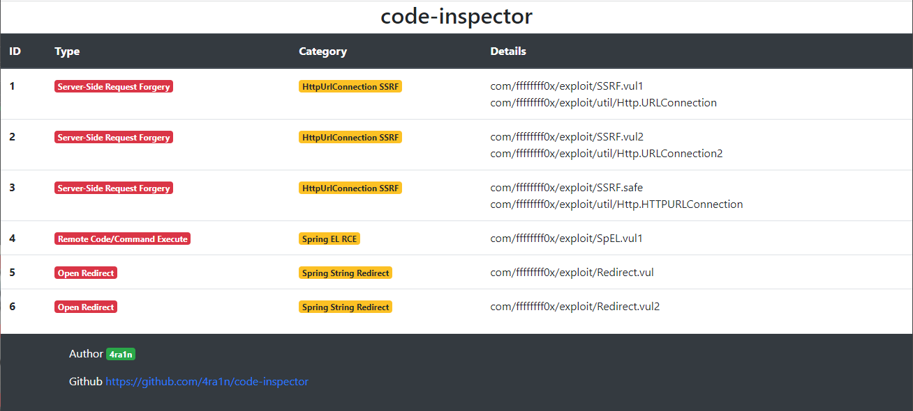

# code-inspector


一个Java自动代码审计工具，尤其针对SpringBoot框架，也可自行改造以适配其他情况

提供一个SpringBoot的Jar包即可进行自动代码审计并生成报告，底层技术基于字节码分析


由于没有真正的执行，例如无法识别过滤等操作，所以会存在误报`false positive`

## 成果

以下靶机存在`JDK 8`下编译打包

靶机`https://github.com/j3ers3/Hello-Java-Sec`的扫描报告：

<details>

<summary>show details</summary>
<br>


</details>

靶机`https://github.com/l4yn3/micro_service_seclab`的扫描报告：

<details>

<summary>show details</summary>
<br>


</details>

靶机`https://github.com/ffffffff0x/JVWA`的扫描报告：

<details>

<summary>show details</summary>
<br>



</details>

靶机`https://github.com/tangxiaofeng7/SecExample`的扫描报告：

<details>

<summary>show details</summary>
<br>


</details>

自带靶机`code-inspector-demo`的扫描报告：

<details>

<summary>show details</summary>
<br>


</details>

## 使用`GUI`启动器

选择好你的`Jar`包后点击`Start`即可，默认开启所有配置

<details>

<summary>show details</summary>
<br>

选项：
- import rt.jar 绝大多数情况请勿勾选
- analyze all libs 绝大多数情况请勿勾选
- debug mode 保存一些临时的分析结果到当前目录中


</details>

### DoS

<details>

<summary>show details</summary>
<br>

配置`DoS`模块：
- `for`循环停止条件可控
- 正则规则和输入同时可控
- 数组初始化大小可控
- `ArrayList`初始化大小可控


</details>

### RCE

<details>

<summary>show details</summary>
<br>

配置`RCE`模块：
- `Runtime.exec`直接/拼接执行命令
- `ProcessBuilder`直接/拼接执行命令
- `JNDI`注入导致RCE（`lookup`内容可控）
- `GroovyShell.evaluate`直接/拼接执行命令
- `Spring EL`直接/拼接执行命令


</details>

### SSRF

<details>

<summary>show details</summary>
<br>

配置`SSRF`模块：
- `HttpUrlConnection`请求
- `Apache HttpClient`请求
- `Socket`建立新连接
- `OKHttp`请求


</details>

### SQL Injection

<details>

<summary>show details</summary>
<br>

配置`SQL Injection`模块：
- `JdbcTemplate.update`存在字符串拼接
- `JdbcTemplate.execute`存在字符串拼接
- `JdbcTemplate.queryAny`存在字符串拼接
- `Statement.executeQuery`存在字符串拼接
- `Statement.executeUpdate`存在字符串拼接
- `Statement.execute`存在字符串拼接


</details>

### Open Redirect

<details>

<summary>show details</summary>
<br>

配置`Redirect`模块：
- 使用`HttpServletResponse.sendRedirect`重定向
- 使用`SpringMVC`直接返回`String`可控
- 使用`SpringMVC`返回`ModelAndView`可控


</details>

### Deserialization

<details>

<summary>show details</summary>
<br>

配置`Deserialization`模块：
- `Java`原生反序列化
- `Fastjson`反序列化
- `SnakeYAML`反序列化
- `Jackson`反序列化
- `Hessian2`反序列化
- `XMLDecoder`反序列化


</details>

## 使用`API`

可以使用以下的方式方便地进行扫描，注意三个`boolean`参数绝大多数情况应该设置为`false`

```java
public static void testRCE() {
    CodeInspector inspector = new CodeInspectorImpl();
    List<ResultInfo> results = inspector.analyzeRCE(
            "your/path/to/jar/file",
            false, false, false);
    System.out.println(results.size());
}
```

## 通用污点传递规则

（1）数组`AASTORE`指令的处理

对数组某个位置赋值的指令一般如下

```text
ANEWARRAY java/lang/String
DUP
ICONST_0
ALOAD 1
AASTORE
```

如果设置到数组的新元素是污点，那么执行`AASTORE`指令后栈顶的`array ref`也应设为污点

（`AASTORE`指令弹出三个参数，此时栈顶被`DUP`的另一份`array ref`是保存污点元素的数组引用）

```java
@Override
public void visitInsn(int opcode) {
    if (opcode == Opcodes.AASTORE) {
        if (operandStack.get(0).contains(Taint.PARAM_TAINT) ||
                operandStack.get(0).contains(Taint.TO_STRING)) {
            super.visitInsn(opcode);
            operandStack.set(0, Taint.PARAM_TAINT);
            return;
        }
    }
    super.visitInsn(opcode);
}
```

（2）处理`getter`方法的传递

调用非静态方法且以`get`开头只有一个参数，当栈顶为污点时可以确定是`getter`方法，应该进行污点传递

```text
INVOKEVIRTUAL xxx/Obj.getXxx ()Ljava/lang/String;
```

```java
if (operandStack.size() > 0 &&
        operandStack.get(0).contains(Taint.PARAM_TAINT) &&
        opcode != Opcodes.INVOKESTATIC) {
    Type[] argTypes = Type.getArgumentTypes(desc);
    Type[] extendedArgTypes = new Type[argTypes.length + 1];
    System.arraycopy(argTypes, 0, extendedArgTypes, 1, argTypes.length);
    extendedArgTypes[0] = Type.getObjectType(owner);
    argTypes = extendedArgTypes;
    super.visitMethodInsn(opcode, owner, name, desc, itf);
    if (operandStack.size() > 0) {
        if (argTypes.length == 1 && name.startsWith("get")) {
            operandStack.set(0, Taint.PARAM_TAINT);
        }
    }
    return;
}
```

（3）一些常见的情况
当以下方法的参数是污点时，执行后认为返回值也被污染了，根据实际情况应该添加更多
- java/util/Base64$Decoder#decode
- java/lang/String#replace
- java/lang/String#format
- java/io/BufferedInputStream#<init>
- java/io/File#<init>
- java/io/FileInputStream#<init>

ref: https://docs.oracle.com/javase/specs/jvms/se8/html/jvms-6.html

## 新规则

如何自定义并添加新的规则

（1）新的`ClassVisitor`应该继承自`BaseClassVisitor`

除非你明白自己在做什么，否则绝大多数情况代码应该如下

```java
public class NewClassVisitor extends BaseClassVisitor {
    public NewClassVisitor(MethodReference.Handle targetMethod, int targetIndex) {
        super(targetMethod, targetIndex, DesMethodAdapter.class);
    }
}
```

（2）新的`MethodAdapter`应该继承自`ParamTaintMethodAdapter`

除非你明白自己在做什么，否则绝大多数情况代码应该如下

在其中编写你需要`Hook`的`JVM`指令，并可以直接通过`operandStack`和`localVariables`拿到栈帧数据进行分析

```java
public class NewMethodAdapter extends ParamTaintMethodAdapter {
    private final Map<String, Boolean> pass;
    public NewMethodAdapter(int methodArgIndex, Map<String, Boolean> pass, int api, MethodVisitor mv,
                            String owner, int access, String name, String desc) {
        super(methodArgIndex, api, mv, owner, access, name, desc);
        this.pass = pass;
    }
    // 添加你需要Hook的指令以及规则
}
```

（3）注意在`Const`中添加你的新规则

一般新分类应该有`NEW_MODULE`变量来表示是否开启整个模块，其次有一些具体的分类变量，例如以下`RCE`相关

```java
// 表示模块是否开启
String RCE_MODULE = "RCE_MODULE";
// 多个分类
String RCE_RUNTIME_TYPE = "RCE_RUNTIME_TYPE";
String RCE_PROCESS_TYPE = "RCE_PROCESS_TYPE";
String RCE_GROOVY_TYPE = "RCE_GROOVY_TYPE";
String RCE_JNDI_TYPE = "RCE_JNDI_TYPE";
String RCE_SP_EL_TYPE = "RCE_SP_EL_TYPE";
```

这个`Const`变量用于保存具体漏洞和收集漏洞信息

```java
// 例如这里的XMLDecoder反序列化漏洞
if (operandStack.get(0).contains(Taint.PARAM_TAINT)) {
    super.visitMethodInsn(opcode, owner, name, desc, itf);
    pass.put(Const.DESERIALIZATION_XML_DECODER, true);
    return;
}
```

例如在`DesCollector`中确认对应的反序列化漏洞信息

```java
// 例如这里的XMLDecoder反序列化漏洞
if (cv.getPass(Const.DESERIALIZATION_XML_DECODER)) {
    ResultInfo resultInfo = new ResultInfo();
    resultInfo.setType(DES);
    resultInfo.setVulName("XMLDecoder readObject");
    resultInfo.getChains().addAll(tempChain);
    results.add(resultInfo);
    Log.info(resultInfo.toString());
}
```

（4）新建`collector`类用于收集扫描结果数据

注意`collect`方法和参数不变，底层使用反射调用

```java
public class NewCollector {
    private static final String NEW = "Your New Type";

    public static void collect(BaseClassVisitor cv, List<String> tempChain, List<ResultInfo> results) {
        if (cv.getPass(Const.YOUR_NEW_VULN)) {
            ResultInfo resultInfo = new ResultInfo();
            resultInfo.setType(NEW);
            resultInfo.setVulName("Your New Vulnerability");
            resultInfo.getChains().addAll(tempChain);
            results.add(resultInfo);
            Log.info(resultInfo.toString());
        }
    }
}
```

(5) 新建`Service`类继承自`BaseService`用于启动分析

`BaseService`类是一切分析的核心，除非你真的明白自己在做什么，否则绝大多数情况代码应该如下

```java
public class NewService extends BaseService {
    public static void start(Map<String, ClassFile> classFileByName,
                             List<SpringController> controllers,
                             Map<MethodReference.Handle, Set<CallGraph>> discoveredCalls) {
        start0(classFileByName,controllers,discoveredCalls,
                NewClassVisitor.class, NewCollector.class);
    }
}
```

(6) 在`Application`中添加新的`Service`即可成功配置

```java
if (globalOptions.getOrDefault(Const.NEW_MODULE, false)) {
    NewService.start(classFileByName, controllers, graphCallMap);
    resultInfoList.addAll(NewService.getResults());
}
```

通过以上的配置，可以使用`API`来扫描，通过`GUI`启动扫描任务的还需要对界面进行编辑
