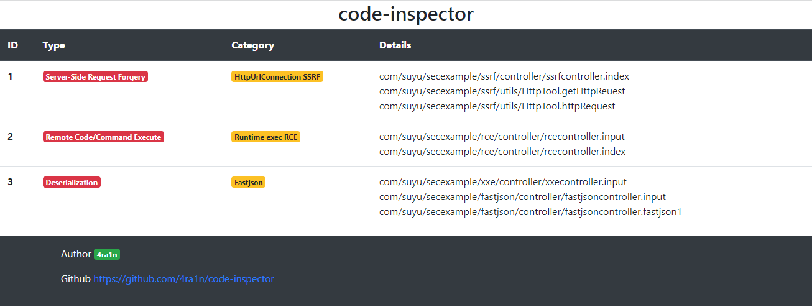
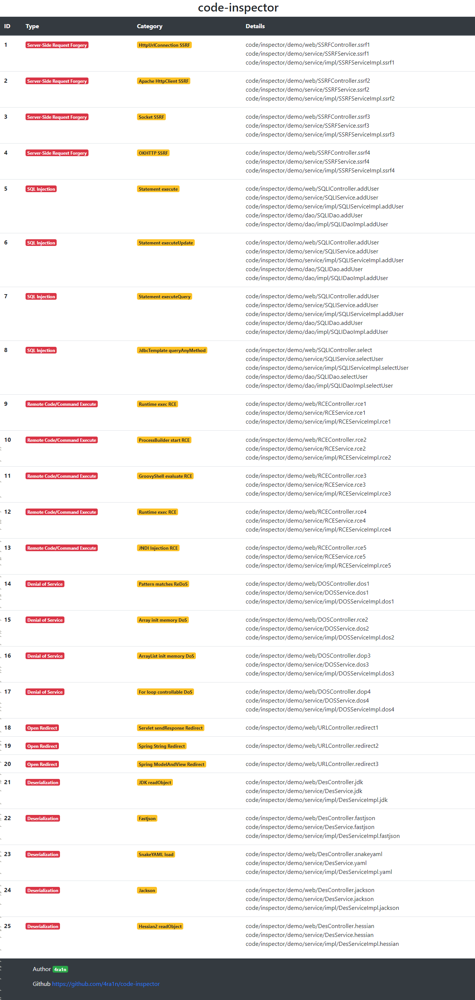

## 成果

以下靶机存在`JDK 8`下编译打包

### 靶机一

靶机`https://github.com/j3ers3/Hello-Java-Sec`的扫描报告：

### 靶机二

靶机`https://github.com/l4yn3/micro_service_seclab`的扫描报告：

### 靶机三

靶机`https://github.com/ffffffff0x/JVWA`的扫描报告：

### 靶机四

靶机`https://github.com/tangxiaofeng7/SecExample`的扫描报告：

### 靶机五

自带靶机`code-inspector-demo`的扫描报告：

